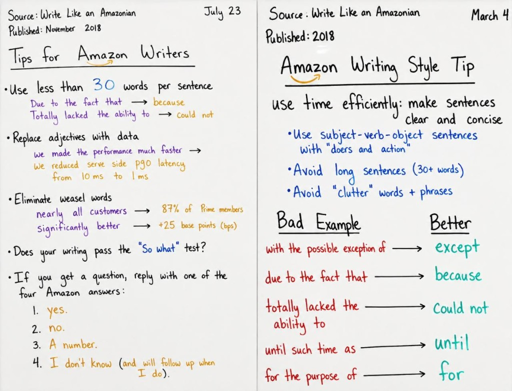

# Write Like an Amazonian — Reference

Shared by [four-answers](../four-answers/) and [amazon-writing](../amazon-writing/) skills.

**Spec-driven:** See [amazon-writing/docs/spec-driven.md](../amazon-writing/docs/spec-driven.md) — PR/FAQ as agent + human contract.

## Five rules

1. Fewer than 30 words per sentence
2. Replace adjectives with data
3. Eliminate weasel words
4. Pass the "so what?" test
5. Four answers: Yes · No · a number · I don't know but I'll know it by X

## Weasel words → data

| Don't | Do |
|-------|-----|
| nearly all customers | 87% of Prime members |
| significantly better | +25 bps |
| much faster | p90 latency 10 ms → 1 ms |

## Sources

- [Fact of the Day 1 — Write Like an Amazonian](https://www.factoftheday1.com/p/april-13-write-like-an-amazonian)
- [Working Backwards PR/FAQ](https://workingbackwards.com/resources/working-backwards-pr-faq/)
- [About Amazon — narratives](https://www.aboutamazon.com/news/workplace/an-insider-look-at-amazons-culture-and-processes)

Full history and Chris Braganos context: [four-answers/amazon-writing.md](../four-answers/amazon-writing.md)
