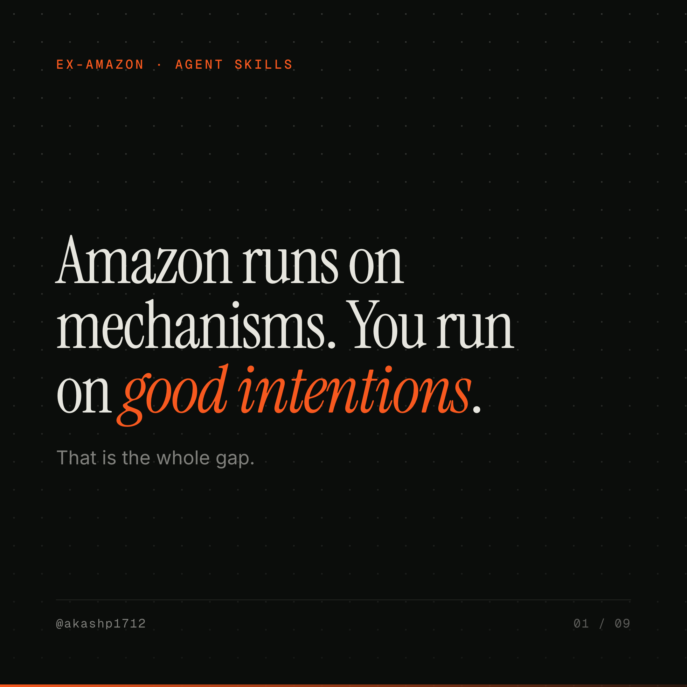
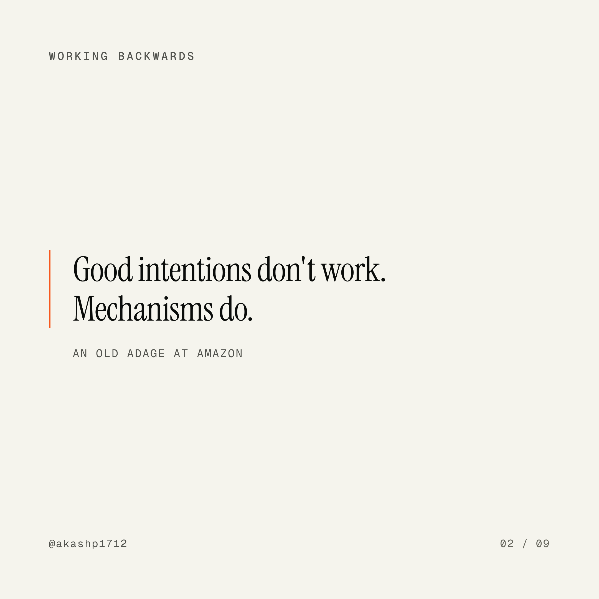
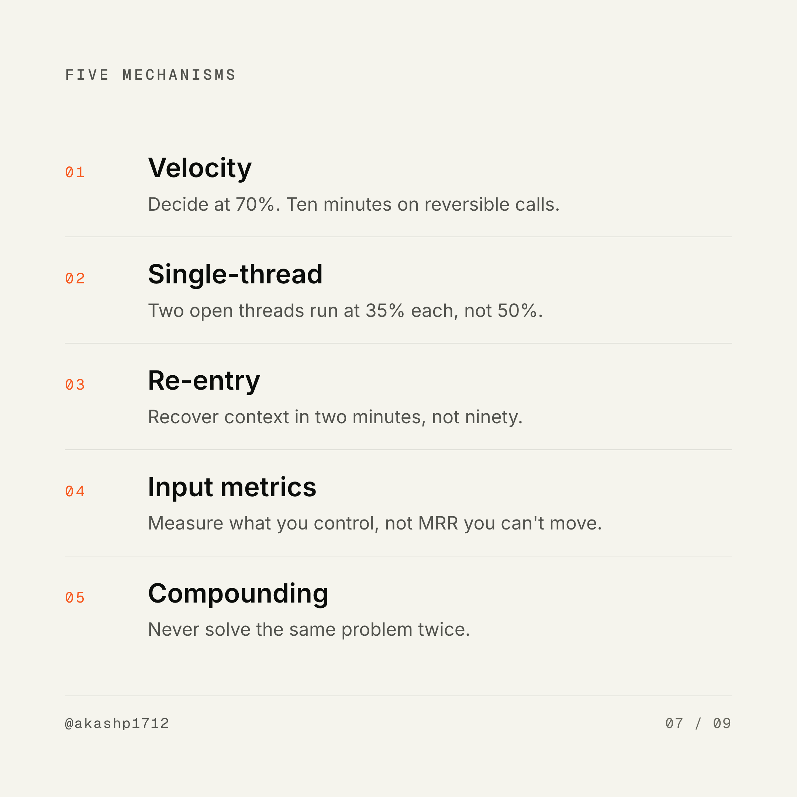

# Carousel Press

**Write a text file. Get LinkedIn carousel slides.**

An opinionated design system in a warm editorial letterpress style — oversized Instrument Serif headlines, mono eyebrows at wide tracking, hairline rules instead of boxes, one accent color, and a masked dot-grid on dark slides.

No template picker. No drag-and-drop. No AI-generated imagery. One deck file in, slides out.



---

## Install

```bash
npx skills add akashp1712/skills --skill carousel-press
```

Renders through **headless Chrome**, which you almost certainly already have. Nothing to `pip install`, no Playwright browser download.

---

## Use

```bash
python3 scripts/render.py mypost.deck.md
```

```
mypost.deck.md: 9 slides
  01  cover     dark Amazon runs on mechanisms. You run on *good intentions*.
  02  quote          Good intentions don't work. Mechanisms do.
  ...
  wrote 01.png … 09.png
  wrote mypost.pdf

Upload the PDF to LinkedIn as a document post — that is a carousel.
```

You get **1080×1080 PNGs at 2× retina** and a **square PDF**. The PDF matters: on LinkedIn a carousel *is* a document post, and documents are PDFs.

---

## The deck format

````markdown
---
handle: "@yourhandle"
footer: yoursite.com
accent: "#f7591f"
---

::: cover dark
eyebrow: SECTION LABEL
# Headline with an *accented phrase*.
Optional supporting line.
:::

::: quote
> The quoted sentence.
— Attribution
:::

::: list
eyebrow: FIVE THINGS
- Title :: supporting line after the double colon
:::

::: data dark
stat: 70%
label: WHAT THE NUMBER MEANS
:::

::: terminal dark
$ npx skills add owner/repo --skill name
:::

::: cta dark
# The line worth screenshotting.
:::
````

`*phrase*` renders as accent italic serif — the signature move. One per headline.

Seven layouts: `cover`, `statement`, `quote`, `list`, `data`, `terminal`, `cta`. Add `dark` to any of them.

| | |
|---|---|
|  |  |

---

## What it handles for you

**Auto-fit.** Oversized headlines shrink until they fit rather than clipping. You write the sentence; the renderer solves the layout.

**Auto-numbering.** List items get `01`, `02`, `03` in mono accent with hairline separators between them.

**Slide counters** in the footer, and the final `cta` slide swaps the counter for your link.

**Hanging indents** on terminal commands, so a wrapped command aligns under itself instead of under the `$`.

**Retina output** at 2160×2160 by default. Use `--scale 1` for 1080.

---

## Options

```bash
python3 scripts/render.py deck.md --check      # validate, render nothing
python3 scripts/render.py deck.md -o out/      # output directory
python3 scripts/render.py deck.md --pdf-only
python3 scripts/render.py deck.md --png-only
python3 scripts/render.py deck.md --scale 1
```

Override the browser with `CAROUSEL_CHROME=/path/to/chrome`. Fonts load from Google Fonts on first render; offline it falls back to system serif, sans, and mono.

---

## The design system

Tokens follow [littlemight.com](https://www.littlemight.com) — a strict four-color palette and three typefaces, each with exactly one job.

```css
--paper:  #f5f4ed    /* warm off-white */
--ink:    #0b0d0b    /* near-black, faintly green */
--muted:  #52534e    /* warm gray */
--accent: #f7591f    /* burnt orange — the only color */
```

Instrument Serif at weight 400 for display, Inter for body, Geist Mono for eyebrows and metadata. Dark slides invert to ink with a warm opacity ladder rather than gray, plus a masked dot grid.

Everything lives in [`assets/theme.css`](assets/theme.css). Change `accent` in your deck frontmatter for a one-off, or edit the file to make it yours.

**No icons and no illustrations, by design.** The visual identity is type and rules. Adding an icon set breaks it.

---

## Editorial rules

The design is handled. These are what actually decide whether the carousel works.

- **One idea per slide.** A comma-spliced second clause means it is two slides.
- **Headlines under 12 words.** The type is 104px; long headlines auto-shrink, and a shrunken headline is a wasted slide.
- **8–10 slides.** Under 6 feels thin, over 12 loses people.
- **One accented phrase per headline.** Two and neither reads.
- **Never invent a quote or a statistic.** Attribute to a real, checkable source or cut the slide.
- **Vary the rhythm.** Alternate light and dark; break prose with a `data`, `quote`, or `list`.
- **The last slide asks for one thing.** One command or one link, never both.

A sequence that reliably works:

```
cover        the claim, stated flatly
statement    the problem they recognize
quote/data   evidence from a real source
statement    the reframe they haven't considered
list         the system
terminal     how to get it
cta          the line worth screenshotting
```

---

## Example

Rendered decks (PDF + PNGs + post copy) live in [`carousels/`](../carousels). The team-of-one example:

```bash
python3 scripts/render.py ../carousels/team-of-one/team-of-one.deck.md
```

---

## Companion skills

| Skill | Use |
|-------|-----|
| [amazon-writing](../amazon-writing) | Cut the source text before it becomes slides |
| [four-answers](../four-answers) | Kill weasel words — fatal at 104px |
| [team-of-one](../team-of-one) | The operating mechanisms the example carousel is about |

MIT licensed.
